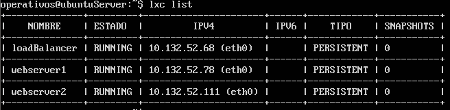
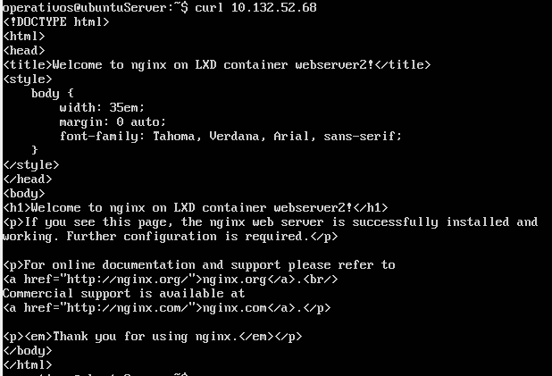
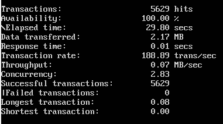
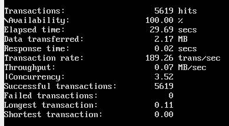
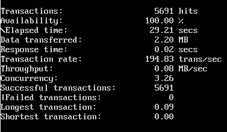
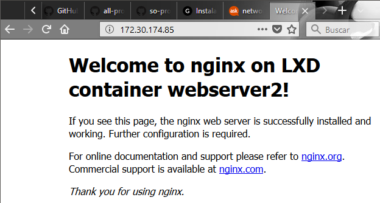
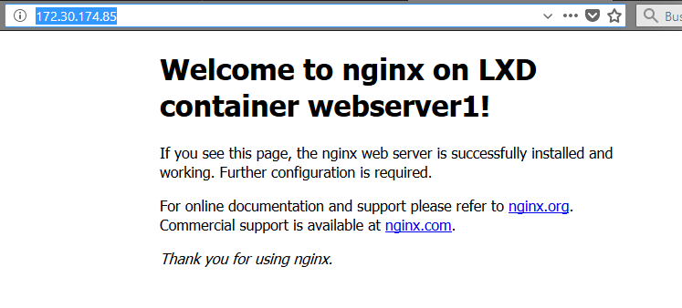

# so-project

**Universidad Icesi**  

**Curso:** Sistemas Operativos  

**Estudiante 1:** Santiago Fajardo Sima  
**Codigo:** A00328044  
**Correo:** santiago_fajardo96@hotmail.com  

**Estudiante 2:** Daniel Perez Garcia  
**Codigo:** A00018200  
**Correo:** danielperga97@outlook.com 

**Estudiante 3:** Julián Alberto Niño Tovar  
**Codigo:** A00328080  
**Correo:** juliannino01@hotmail.com  

**URL del Repositorio:**  https://github.com/santyfajardo/so-project/

### Instalación Ambiente Para Usuario:

1. Se instaló el servidor virtual Ubuntu Xenial Server , creando el usuario operativos.  


2. Para  acceder al administrador de contenedores,  se agregó el usuario operativos al grupo lxd. Esto se hizo con el comando :
```
sudo usermod --append --groups lxd operativos
```

Usamos el sistema ZFS, El storage pool es un conjunto de discos en el que el servidor de Data Protection Manager almacena réplicas, instantáneas y registros de transferencia, entre las ventajas de ZFS se encuentra que debido a sus características permite mejorar la eficiencia de almacenamiento y velocidad de respuesta. Se utilizan los siguientes comandos:
```
sudo apt-get update
sudo apt-get install zfsutils-linux
```
Despues de eso se configura la inicialización de los contenedores, con este comando:
```
sudo lxd init
```
Se crea  un storage pool, el cual permite agrupar varias unidades de almacenamiento
```
Do you want to configure a new storage pool (yes/no) [default=yes]? yes

Name of the storage backend to use (dir or zfs) [default=zfs]: zfs

Create a new ZFS pool (yes/no) [default=yes]? yes
Name of the new ZFS pool [default=lxd]: lxd
```

Se deberá especificar el directorio y crear un volumen. Ademas se especifica el espacio de disco el cual son de aproximadamente
15 GB
```
Would you like to use an existing block device (yes/no) [default=no]? no

Size in GB of the new loop device (1GB minimum) [default=15]: 15
```
4.  Se configura la Red de los contenedores, con un puente de red 
```
Do you want to configure the LXD bridge (yes/no) [default=yes]? yes
```
Esto abrirá una pantalla en donde se:  
- Acepta la IP generada y la mascara de red 

### Creación contenedores con Servicio WEB

Para crear los contenedores se usa:
```
lxc launch ubuntu:x webserver1
lxc launch ubuntu:x webserver2
```
El cual si se interactua por primera vez descarga la imagen de ubuntu xenial (ubuntu:x)
Despues de lo anterior se ingresan los siguientes comandos:
```
lxc exec webserver1 -- sudo --login --user ubuntu
```
Se Instala Nginx para la configuración del servidor web con los siguientes comandos:
```
sudo apt-get update
sudo apt-get install nginx
```
Se ingresa a la pagina web por default del sevidor, y se modifica el archivo, para que retorne una pagina html:
```
$  sudo nano /var/www/html/index.nginx-debian.html

<!DOCTYPE html>
<html>
    <head>
        <title>Welcome to nginx on LXD container webserver1!</title>
        <style>
    body {
        width: 35em;
        margin: 0 auto;
        font-family: Tahoma, Verdana, Arial, sans-serif;
    }
</style>
    </head>
    <body>
        <h1>Welcome to nginx on LXD container webserver1</h1>
        <p>If you see this page, the nginx web server is successfully installed and
working. Further configuration is required.</p>
        <p>For online documentation and support please refer to

            <a href="http://nginx.org/">nginx.org</a>.
            <br/>
Commercial support is available at
            <a href="http://nginx.com/">nginx.com</a>.
        </p>
        <p>
            <em>Thank you for using nginx.</em>
        </p>
    </body>
</html>
```

  Se Reinició el servicio nginx y salimos del contenedor, usando el comando: 
```
sudo service nginx restart
logout
```
**Repetimos el mismo proceso para el Webserver 2**  
Cambiamos el titulo en la pagina web por: Welcome to nginx on LXD container webserver2.De tal manera se puede diferenciar   

### Creación Balanceador de Carga

Se creó el balanceador de carga con el comando :
```
lxc launch ubuntu:x loadBalancer
```
Se ingresa al balanceador de carga con el comando:
```
lxc exec loadBalancer -- sudo --login --user ubuntu
```
Instalamos Nginx, el cual tambien se puede confirgurar como balanceador de carga y actuar como proxy para los servidores Web.
```
sudo apt-get update
sudo apt-get install nginx
```
Configuramos el balanceador de carga, editando el siguiente archivo:
```
$ sudo nano /etc/nginx/conf.d/load-balancer.conf 

upstream backend {
   server 10.132.52.68; 
   server 10.132.52.111;  
}
server {
   location / {
      proxy_pass http://backend;
   }
}
```
En el bloque de servidores  se les pasara las peticiones.
Para Ubuntu, se debe eliminar la pagina por default, para que cuando se hagan solicitudes al balanceador no retorne la pagina html, y ademas se reinicia el servicio nginx con :
```
sudo rm /etc/nginx/sites-enabled/default
sudo service nginx restart
```   
### Prueba de LXC List
Usando el siguiente comando podemos ver los contenedores que se han creado.  
 

### Pruebas de carga del Balanceador

Se realizan peticiones por medio de Curl al balanceador:

  
 

Para las pruebas de carga :   

- Para cambiar el porcentaje de CPU:  (#: como inditificador del server)
```
lxc config set webserver# limits.cpu.allowance 100%
lxc config set webserver# limits.cpu.allowance 50%
```

- Para cambiar la cantidad de memoria RAM:  (#: como identificador del server)
```
lxc config set webserver# limits.memory 64MB
lxc config set webserver# limits.memory 128MB
```
Para realizar las pruebas se usa siege:   
-Se instala:
```
sudo apt-get install siege
```

Se corre el siguiente comando, para cada combinacion:   
```
siege -c 100 -t 30s http://10.132.52.68/
```

#### Resultados :

**CPU: 100% - RAM: 128MB:**  


**CPU: 100% - RAM: 64MB:**   


**CPU: 50% - RAM: 128MB:**   


**CPU: 50% - RAM: 64MB:**  


### Acceso desde SO anfitrion
Para permitir las peticiones al balanceador de carga desde el SO 
anfitrion se debe crear una regla de FORWARDING en el SO Ubuntu, 
por medio de los siguientes comandos:
```
PORT=80 PUBLIC_IP=170.30.165.61 CONTAINER_IP=10.132.52.68
sudo iptables -t nat -I PREROUTING -i enp0s8 -p TCP -d $PUBLIC_IP --dport $PORT -j DNAT --to-destination $CONTAINER_IP:$PORT -m comment --comment "forward to the Nginx container"
```
Por medio del navegador Chrome se hacen peticiones, a la IP del servidor (172.30.165.61)




### Opcional

1. Cuando se reinicia una maquina virtual, los contenedores quedan en el ultimo estado en el cual se encontraban.  
Ya sea en estado RUNNING o STOPPED.
